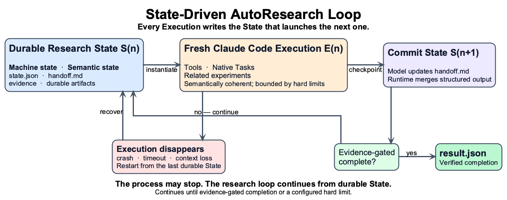
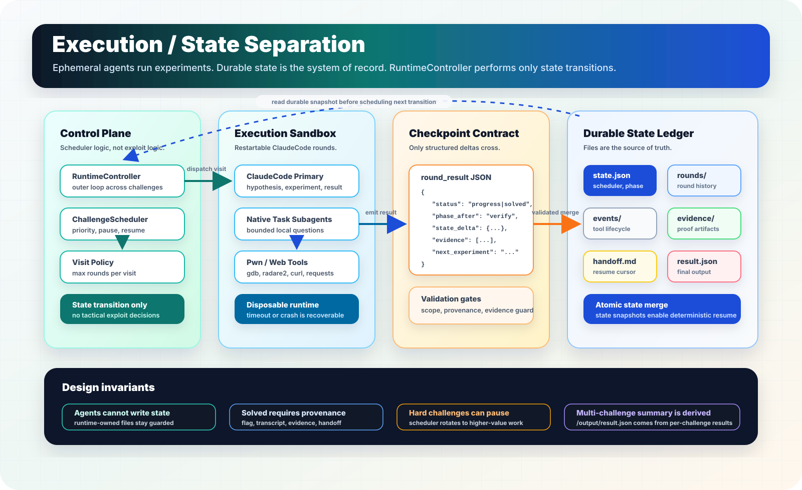

# AIxCTF

**A CTF AutoResearch project built around Claude Code, durable research data,
and a strict separation between execution and data.**

AIxCTF applies the AutoResearch model to CTF solving. Instead of treating a
challenge as one long chat or repeatedly asking a model for a flag, it turns
the solve process into bounded research rounds:

```text
question -> hypothesis -> experiment -> observation
         -> evidence -> conclusion -> next experiment
```

The second core idea is execution/data separation. Claude Code processes are
restartable executors. Research state lives outside the model context in files
owned by the runtime. The executor may stop, time out, or be replaced without
making its chat history the only record of the research.

Each fresh Execution reads both machine state (`state.json`) and model-maintained
semantic state (`handoff.md`). Normal Stop and automatic context-compaction
checkpoints ask the model to externalize that state; after an interruption, the
next Execution reconciles it with durable artifacts instead of resuming hidden
conversation context.

> Context is not memory. Durable state is memory.



AIxCTF is an early CTF AutoResearch implementation. It is not a benchmark
claim, a production-grade sandbox, or a promise that Claude Code can solve
every CTF challenge.

## Two design principles

### AutoResearch for CTF

Each round must externalize what it tried, what it observed, what evidence it
found, and what should happen next. Failed paths and open questions become
inputs to later rounds instead of disappearing into transient context.

### Execution and data separation

Claude Code is the semantic executor: it reasons about the challenge, runs
experiments, and attempts exploits. The runtime owns scheduling, state
transitions, validation, and durable artifacts:

```text
challenge
  -> runtime controller
  -> challenge scheduler
  -> bounded research round
  -> Claude Code
  -> hook checkpoints
  -> state, evidence, handoff, and result
```



A chat transcript is transient and difficult to audit. AIxCTF instead records
each challenge in an isolated workspace so a run can be inspected and resumed
from durable facts.

The outer `RuntimeController` schedules challenge visits until challenges are
solved, exhausted, or a hard runtime limit is reached. In multi-challenge mode,
each active challenge gets its own workspace and Claude Code child process.

## Evidence-gated results

The runtime does not accept a bare claim that a challenge is solved. A solved
result requires an exact flag, an evidence artifact containing the flag, and
reproducible command or script provenance. A failed result records a failure
reason and handoff so later work can continue from the observed state.

This is a first evidence gate, not an independent flag verifier.

## Quick start

Requirements for a local dry-run:

- Python 3.11 or newer;
- no API key or Claude Code installation is required.

Syntax-check the runtime:

```bash
python3 -m compileall .claude
```

Run two bounded rounds without invoking Claude Code or writing generated files
into the repository:

```bash
WORKDIR=/tmp/aixctf-ws \
OUTPUT_DIR=/tmp/aixctf-out \
CHALLENGE_DIR=. \
CHALLENGE_ID=local-smoke \
AIXCTF_CHALLENGE_MODE=single \
AIXCTF_DRY_RUN=1 \
AIXCTF_MAX_ROUNDS=2 \
AIXCTF_MAX_ROUNDS_PER_VISIT=1 \
python3 .claude/entrypoint.py
```

The expected dry-run result is `failed` with
`failure_reason: dry_run_no_solver`. That status confirms the controller and
artifact pipeline ran without pretending a solver was present.

Build the runtime image:

```bash
docker build -t aixctf-agent .claude
```

For a real challenge run, mount or point `CHALLENGE_DIR` at the challenge input,
set a writable workspace and output directory, authenticate Claude Code through
its supported environment, and set `AIXCTF_DRY_RUN=0`.

## Durable state and outputs

Each challenge workspace contains runtime-owned artifacts such as:

```text
$WORKDIR/
  challenge/
  rounds/*.json
  events/*.json
  evidence/
  state.json
  progress.jsonl
  status.json
  notes.md
  handoff.md
  result.json
```

In multi-challenge mode, state is isolated under one workspace per challenge.
The controller writes individual challenge results plus a controller summary.

## Architecture

The implementation lives under `.claude/`:

```text
.claude/
  entrypoint.py   runtime entrypoint
  runner/         controller, scheduler, rounds, state, and results
  hooks/          deterministic tool checkpoints and guards
  sync/           fail-open human progress synchronization
  templates/      category and bounded subtask prompts
  docs/           routed tactical knowledge cards
  tools/          pwn and web triage helpers
```

Start with the [architecture index](arch.md), or read these focused documents:

- [Architecture overview](docs/architecture/01-overview.md)
- [AutoResearch loop](docs/architecture/02-autoresearch-loop.md)
- [Runtime components](docs/architecture/03-runtime-components.md)
- [State, artifacts, and results](docs/architecture/04-state-artifacts-results.md)
- [Execution and handoff protocols](docs/architecture/05-subagents-and-handoff.md)
- [Hooks, progress, and human sync](docs/architecture/06-hooks-progress-sync.md)
- [Knowledge library and prompts](docs/architecture/07-knowledge-library-prompts.md)
- [Build and acceptance criteria](docs/architecture/08-build-mvp-acceptance.md)
- [Architecture diagrams](docs/architecture/diagrams/README.md)

## Current limitations

- No independent flag verifier exists yet.
- Hooks are checkpoint controls and guardrails, not a complete security boundary.
- State is persisted, but updates do not yet provide full transactional or
  event-sourced recovery semantics.
- No public benchmark or solve-rate claim has been published.
- The Docker dependency chain needs stronger version and checksum pinning for
  reproducible builds.

## Contributing

Technical feedback and focused contributions are welcome, especially around
verifiers, sandbox hardening, runtime reliability, challenge adapters,
benchmarking, scheduler policies, result schemas, and tactical knowledge cards.

Please keep runtime changes inside `.claude/`, preserve challenge scope checks,
and include the validation commands and security impact in pull requests.

## License

Licensed under the [Apache License 2.0](LICENSE).
