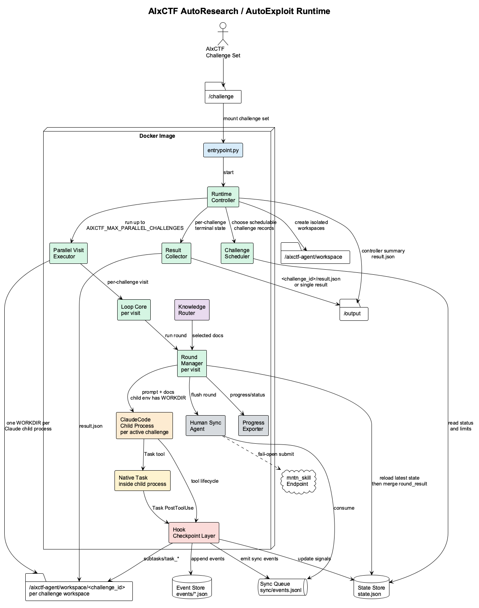

# AIxCTF ClaudeCode AutoResearch Runtime

Dockerized CTF solving runtime that uses ClaudeCode as the semantic solver, deterministic hooks as checkpoint controls, and durable workspace artifacts as the source of truth.

The runtime is designed as an outer controller loop over challenges and an inner
round loop per challenge. `RuntimeController` keeps scheduling challenges until
all are solved or a hard runtime limit is reached. Each round records a research
question, hypothesis, experiment, observation, evidence, conclusion, and next
experiment.


## Architecture

Start with the split architecture docs:

- [Architecture Index](arch.md)
- [Architecture Overview](docs/architecture/01-overview.md)
- [AutoResearch Loop](docs/architecture/02-autoresearch-loop.md)
- [Runtime Components](docs/architecture/03-runtime-components.md)
- [State, Artifacts, and Results](docs/architecture/04-state-artifacts-results.md)
- [Subagents and Handoff](docs/architecture/05-subagents-and-handoff.md)
- [Hooks, Progress, and Human Sync](docs/architecture/06-hooks-progress-sync.md)
- [Knowledge Library and Prompts](docs/architecture/07-knowledge-library-prompts.md)
- [Build, MVP Plan, and Acceptance](docs/architecture/08-build-mvp-acceptance.md)

The current monolithic handoff is available at [docs/architecture/full-handoff-v1.md](docs/architecture/full-handoff-v1.md).

## Diagrams

Rendered PlantUML diagrams are available in [docs/architecture/diagrams](docs/architecture/diagrams/README.md).



Key diagrams:

- [Execution and State Separation](docs/architecture/diagrams/execution-state-separation.svg)
- [Runtime Path Mapping](docs/architecture/diagrams/runtime-path-mapping.png)
- [Parallel Challenge Scheduling](docs/architecture/diagrams/parallel-challenge-scheduling.png)
- [Round Lifecycle](docs/architecture/diagrams/round-lifecycle.png)
- [Phase State Machine](docs/architecture/diagrams/phase-state-machine.png)
- [Human Sync Flow](docs/architecture/diagrams/human-sync-flow.png)
- [Subagent Handoff](docs/architecture/diagrams/subagent-handoff.png)

## Repository Layout

```text
.claude/
  entrypoint.py
  runner/        controller scheduler, round loop, state stores, progress/status
  hooks/         Claude Code hook adapters and guards
  sync/          fail-open human progress sync
  templates/     generic, pwn, web, and native Task subagent prompts
  docs/          knowledge index and tactical cards
  tools/         pwn/web triage helpers
docs/
  architecture/  split architecture documents and diagrams
```

Runtime output directories such as `.claude/workspace/`, `.claude/output/`, logs, and generated caches are ignored.

Default Docker workspaces live under `/aixctf-agent/workspace/<challenge_id>/`.
With the provided compose file, host `.claude/workspace/<challenge_id>/` maps to
that Docker path. See `.claude/docs/runtime/path_mapping.md` for the full path
mapping.

## Build and Run

Build the Docker image:

```bash
docker build -t aixctf-agent .claude
```

Run a local dry-run without ClaudeCode:

```bash
CHALLENGE_ID=sample CHALLENGE_DIR=. OUTPUT_DIR=/tmp/aixctf-out \
  AIXCTF_DRY_RUN=1 AIXCTF_MAX_ROUNDS=2 AIXCTF_MAX_ROUNDS_PER_VISIT=1 \
  python3 .claude/entrypoint.py
```

For a directory containing multiple challenges, set `CHALLENGE_DIR` to the
bundle root. Auto-discovery is enabled by default; use
`AIXCTF_CHALLENGE_MODE=single` or `AIXCTF_CHALLENGE_MODE=multi` to force either
mode.

In multi-challenge mode the controller can run several challenge visits at the
same time. Each visit launches its own ClaudeCode process with an isolated
`WORKDIR` under `/aixctf-agent/workspace/<challenge_id>/`. Set
`AIXCTF_MAX_PARALLEL_CHALLENGES` to control this fan-out; the default is 2 for
multi-challenge runs and 1 for single-challenge runs.

Default runtime limits are 12 rounds per challenge, 3 rounds per controller
visit, 7200 seconds overall, and 7200 seconds per ClaudeCode call. Native Task
subagents run inside that primary ClaudeCode session and share the same call
limit.
Override them with `AIXCTF_MAX_ROUNDS`, `AIXCTF_MAX_ROUNDS_PER_VISIT`,
`AIXCTF_MAX_SECONDS`, and `AIXCTF_MAX_CMD_SECONDS`.

Syntax-check Python modules:

```bash
python3 -m compileall .claude
```

Render diagrams locally:

```bash
plantuml -tpng docs/architecture/diagrams/*.puml
```

## Outputs

The runtime writes:

- `$WORKDIR/state.json`
- `$WORKDIR/rounds/*.json`
- `$WORKDIR/events/*.json`
- `$WORKDIR/progress.jsonl`
- `$WORKDIR/status.json`
- `$WORKDIR/handoff.md`
- `$WORKDIR/result.json`
- `/output/<challenge_id>/result.json` for each challenge in multi-challenge mode
- `/output/result.json` as the single-challenge result or multi-challenge controller summary

Solved results require an exact flag plus evidence. Failed results require a handoff and failure reason.
